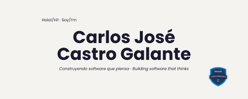

  

# Carlos José Castro Galante

Full Stack Developer y Azure AI Engineer radicado en Argentina.
Certificado por Microsoft (AI-102 · AI-900 · AZ-900) y por el ITBA · Microsoft Student Ambassador 2026.
Actualmente cursando Diseño de Software en la Universidad Nacional de Catamarca.

Construyo aplicaciones web e integro inteligencia artificial en productos que tienen que funcionar en producción.
Mi foco está en arquitectura limpia, impacto real y hacer que las cosas complejas se sientan simples.

[Portfolio](https://carlosjcastrog.com) · [LinkedIn](https://linkedin.com/in/carlosjcastrog) · [Certificaciones](https://certificar.carlosjcastrog.com) · carlosjcastrog.dev@gmail.com

---

## Con qué trabajo

**Frontend** · React · Next.js · TypeScript · Tailwind CSS · Vite
**Backend** · Python · FastAPI · Django · Node.js · PostgreSQL
**IA & Cloud** · Azure AI Foundry · Azure AI Services · LLMs · Pipelines de agentes
**Herramientas** · Git · Supabase · REST APIs · Microsoft 365

---

## Proyectos seleccionados

**[FaroIQ](https://faroiq.vercel.app)** - [github.com/carlosjcastro/faroiq](https://github.com/carlosjcastro/faroiq)
Pipeline de 9 agentes de IA construido sobre Azure AI Foundry para ONGs en América Latina.
Produce análisis de necesidades, planes de implementación, proyecciones de impacto y propuestas de financiamiento en menos de 90 segundos.
Construido solo para el Microsoft Agents League Hackathon 2026 · `Python` `FastAPI` `React` `Azure AI Foundry` `Microsoft 365`

**[DuckBank](https://github.com/carlosjcastro/duckbank)**
Home banking full stack con autenticación, transferencias y gestión de préstamos.
`React` `Django` `Django REST Framework` `PostgreSQL`

---

## Programas y participaciones

- **Microsoft Student Ambassador** · Community Influencer · 2026
- **Stanford Code in Place 2026** · Proyecto final seleccionado para el showcase público
- **Microsoft Agents League Hackathon 2026** · FaroIQ
- **Dev3Pack Hackathon 2026** · VeriMatChain AI
- **Microsoft AI Skills Fest 2025** · Guinness World Record

---

> Construyendo software que piensa.
